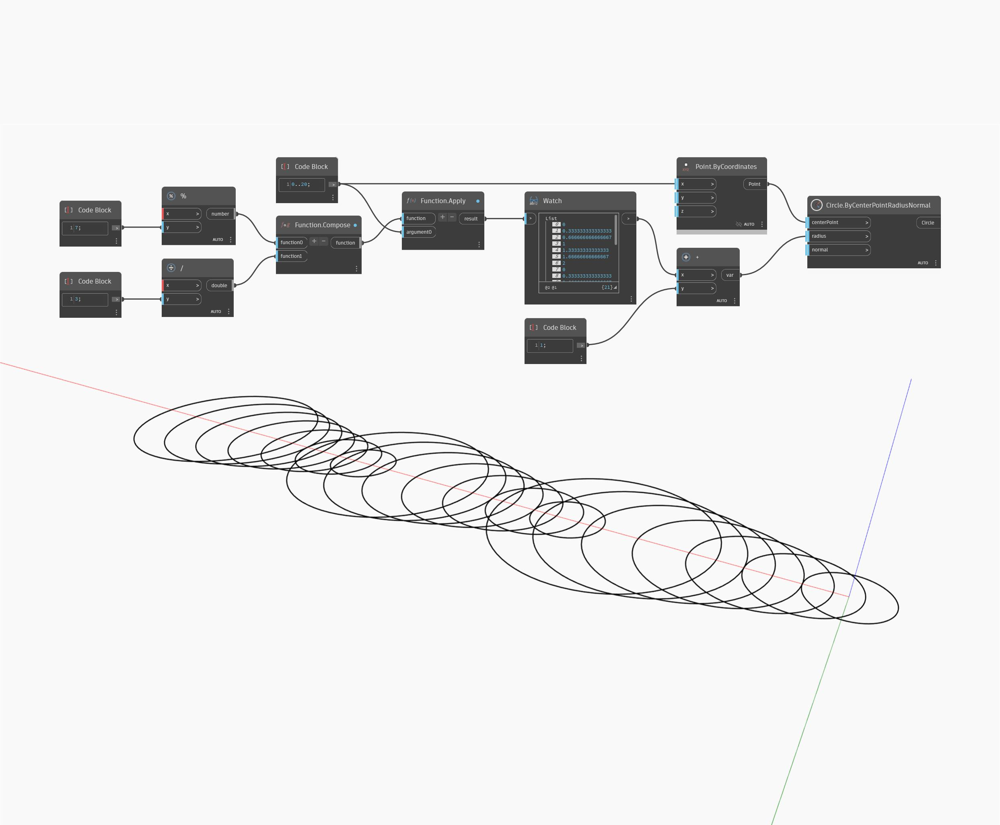

## Description approfondie
Function.Compose renvoie une fonction unique à partir de plusieurs fonctions. Dans l'exemple ci-dessous, les fonctions modulus et divide sont composées en une seule fonction à appliquer à une liste.
___
## Exemple de fichier

