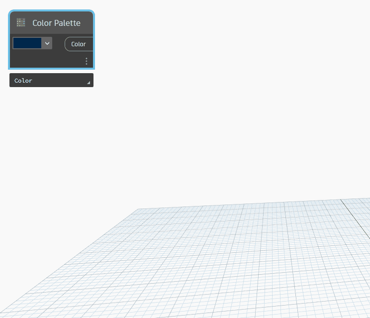

## Description approfondie
La palette de couleurs fournit une interface utilisateur conviviale qui permet de choisir des couleurs à utiliser dans Dynamo. (Bravo à Adam Sheather des Bad Monkeys pour cette option).
___
## Exemple de fichier

