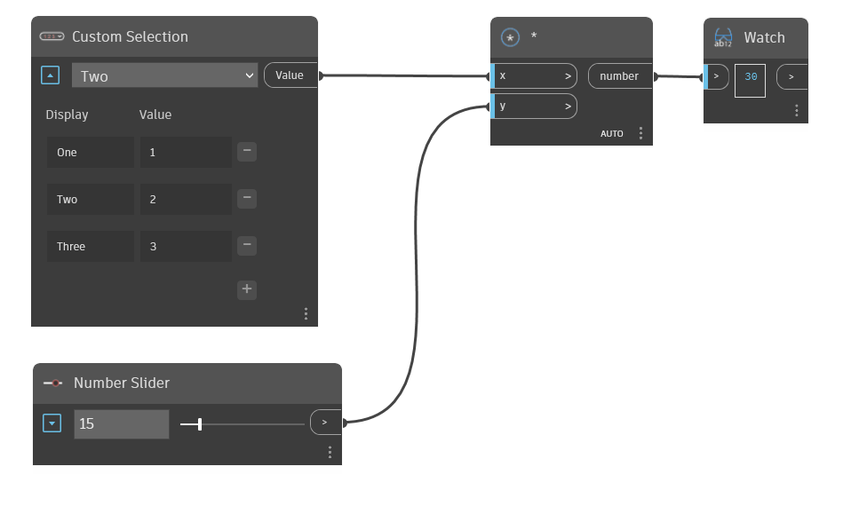

## Description approfondie
Le nœud déroulant Custom Selection permet à l'utilisateur de créer une entrée de sélection dans une liste déroulante avec des étiquettes et des valeurs personnalisées. Si toutes les valeurs sont des nombres, la sortie sera un double et si toutes les valeurs sont des entiers, la sortie sera un entier. Dans l'exemple ci-dessous, `Two` est sélectionné dans le nœud Menu déroulant personnalisé, ce qui fait que la sortie de ce nœud est le nombre entier `2`.
___
## Exemple de fichier

