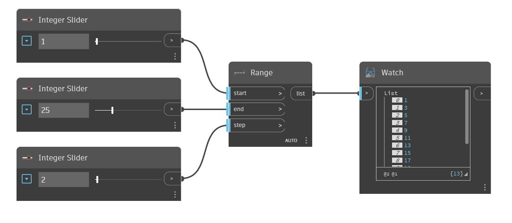

## Description approfondie
Range produit une liste de nombres entre les entrées Start et End spécifiées. Les nombres augmentent à partir de l'entrée Start en fonction de la valeur Step. Dans l'exemple ci-dessous, nous définissons l'entrée Start sur 1 et l'entrée End sur 25. En utilisant une valeur Step de 2, le résultat est obtenu sous forme de nombres impairs compris entre 1 et 25.
___
## Exemple de fichier

