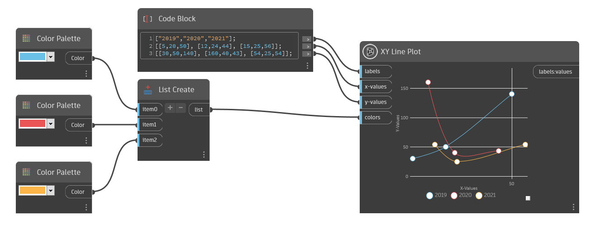

## Description approfondie

L'option Tracé des lignes XY crée un graphique avec une ou plusieurs lignes tracées par leurs valeurs X et Y. Étiquetez vos lignes ou modifiez le nombre de lignes en saisissant une liste d'étiquettes de chaîne dans les entrées des étiquettes. Chaque étiquette crée une nouvelle ligne codée par couleur. Si vous ne saisissez qu'une seule valeur de chaîne, une seule ligne sera créée.

Pour déterminer la position de chaque point le long de chaque ligne, utilisez une liste de listes contenant des valeurs doubles pour les entrées de valeurs X et Y. Les entrées de valeurs X et Y doivent contenir un nombre égal de valeurs. Le nombre de sous-listes doit également correspondre au nombre de valeurs de chaîne dans les entrées d'étiquettes.
Par exemple, si vous souhaitez créer 3 lignes, chacune avec 5 points, indiquez une liste avec 3 valeurs de chaîne dans l'entrée des étiquettes pour nommer chaque ligne, et fournissez 3 sous-listes avec 5 valeurs doubles dans chaque pour les valeurs x et y.

Pour attribuer une couleur à chaque ligne, insérez une liste de couleurs dans les entrées des couleurs. Lorsque vous attribuez des couleurs personnalisées, le nombre de couleurs doit être égal à celui des valeurs de chaînes dans les entrées d'étiquettes. Si aucune couleur n'est attribuée, des couleurs aléatoires seront utilisées.

___
## Exemple de fichier

