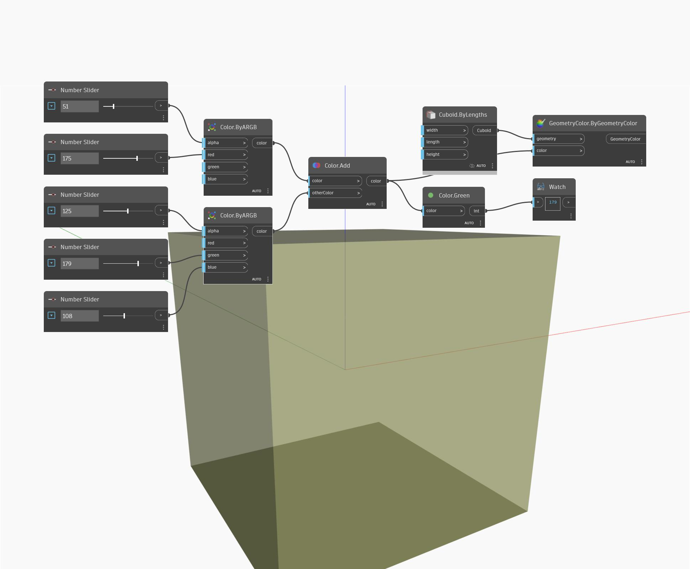

## Description approfondie
Green renvoie la valeur de vert d'une couleur d'entrée comprise entre 0 et 255. Dans l'exemple ci-dessous, nous créons deux couleurs à l'aide de nœuds ByARGB, puis nous additionnons les deux couleurs. La valeur de vert de la couleur résultante est obtenue à l'aide d'un nœud Green.
___
## Exemple de fichier

