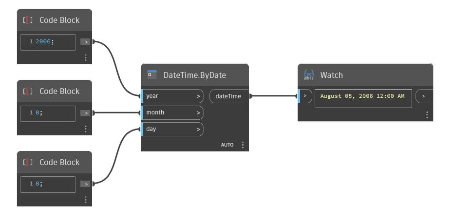

## Description approfondie
ByDate renvoie une dateTime à partir des entrées year, month et day. Dans l'exemple ci-dessous, une nouvelle dateTime au format August 08, 2006 est créée à partir de ces entrées respectives.
___
## Exemple de fichier

