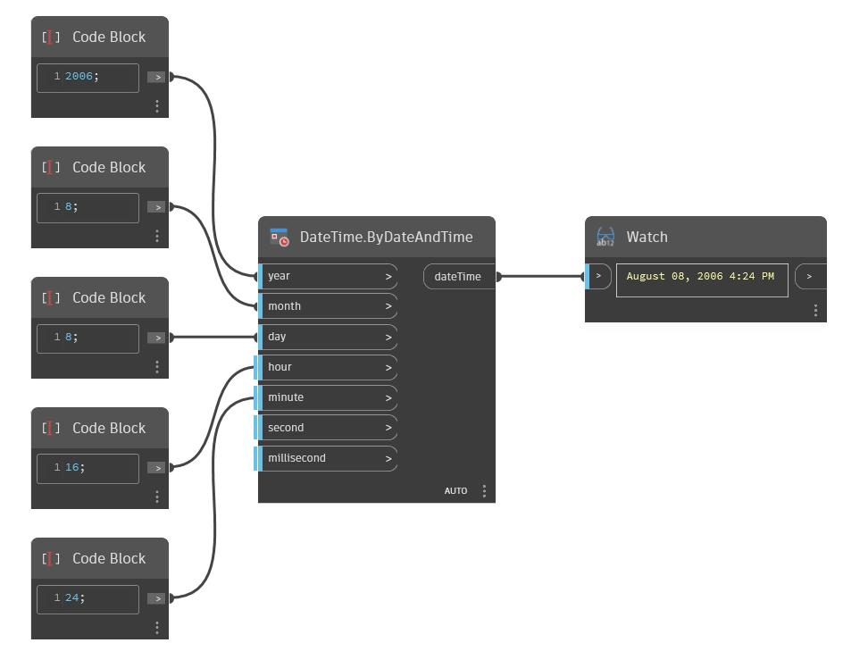

## Description approfondie
ByDateAndTime renvoie une dateTime à partir des entrées year, month, day, hour, minute, seconde et milliseconde. Dans l'exemple ci-dessous, une nouvelle dateTime au format August 08, 2006 4:24PM est créée à partir de ces entrées respectives.
___
## Exemple de fichier

