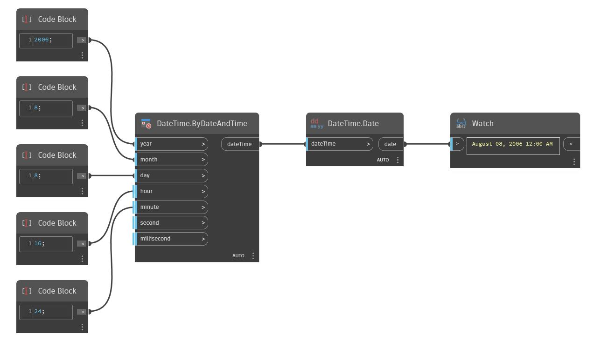

## Description approfondie
Date renvoie uniquement la date (year, month, day) d'une dateTime. Dans l'exemple ci-dessous, seule la date August 08, 2006 est extraite d'une dateTime August 08, 2006 4:24PM.
___
## Exemple de fichier

