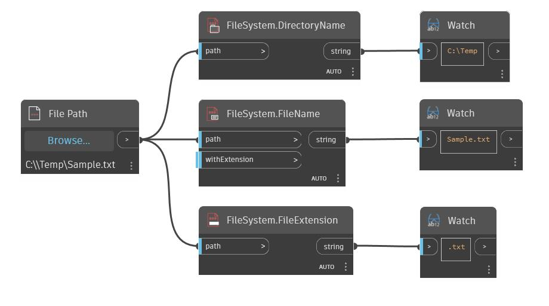

## Description approfondie
DirectoryName renvoie le répertoire d'un fichier ou d'un chemin de répertoire. Dans l'exemple ci-dessous, nous utilisons un nœud DirectoryPath pour extraire le répertoire d'un chemin de fichier. Avec les nœuds FileName et FileExtension, cela nous permet de décomposer un chemin d'accès au fichier en composants distincts.
___
## Exemple de fichier

