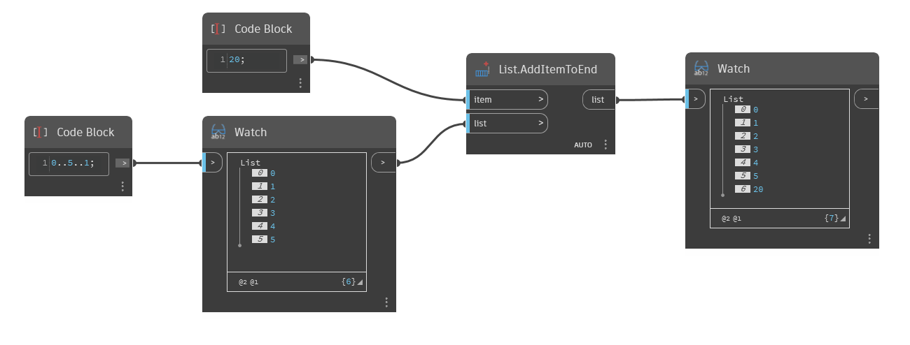

## Description approfondie
`List.AddItemToEnd` insère un élément spécifié à la fin d'une liste donnée. Notez que si un objet de liste est utilisé comme élément à ajouter, l'intégralité de la liste est ajoutée en tant qu'objet unique, produisant une liste imbriquée. Pour combiner deux listes en une seule liste plate, reportez-vous à `List.Join`.

Dans l'exemple ci-dessous, nous utilisons un Code Block pour générer une plage de nombres allant de 0 à 5, avec un incrément de 1. Nous ajoutons ensuite un nouvel élément, le nombre 20, à la fin de cette liste à l'aide du noeud `List.AddItemToEnd`.
___
## Exemple de fichier

