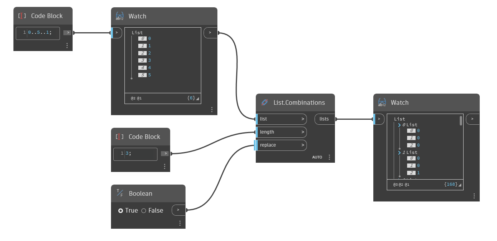

## Description approfondie
`List.Combinations` renvoie une liste imbriquée qui inclut toutes les combinaisons possibles des éléments de la liste d'entrée avec une longueur donnée. Pour les combinaisons, l'ordre des éléments n'a pas d'importance, de sorte que la liste de sortie (0,1) est considérée comme la même combinaison que (1,0). Si l'entrée `replace` est définie sur True, les éléments seront remplacés dans la liste d'origine, ce qui permet de les utiliser de façon répétée.

Dans l'exemple ci-dessous, nous utilisons un Code Block pour générer une plage de nombres entre 0 à 5, avec un incrément de 1. Nous utilisons `List.Combinations` avec une longueur d'entrée de 3 pour générer toutes les différentes façons de combiner 3 des nombres de la plage. La valeur booléenne `replace` est définie sur True, de sorte que les nombres sont utilisés à plusieurs reprises.
___
## Exemple de fichier

