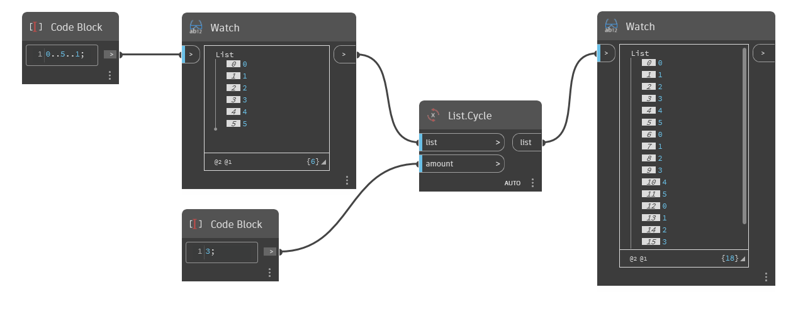

## Description approfondie
`List.Cycle` prend une liste d'entrée et renvoie une nouvelle liste composée de la liste d'entrée répétée un certain nombre de fois en fonction de l'entrée `amount`.

Dans l'exemple ci-dessous, nous utilisons d'abord un Code Block pour générer une plage de nombres entre 0 et 5, avec un incrément de 1. Nous utilisons ensuite un noeud `List.Cycle` avec une valeur d'entrée de 3. Cela renvoie une liste de 18 éléments, composée de 3 cycles de la liste d'origine.
___
## Exemple de fichier

