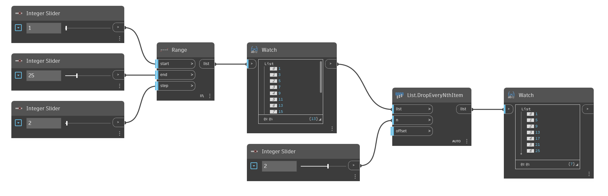

## Description approfondie
`List.DropEveryNthItem` supprime des éléments de la liste d'entrée à des intervalles correspondant à la valeur n d'entrée. Le point de départ de l'intervalle peut être modifié dans l'entrée `offset`. Par exemple, si vous saisissez 3 dans n et que vous laissez la valeur `offset` par défaut sur 0, les éléments avec les index 2, 5, 8, etc. sont supprimés. Avec un décalage de 1, les éléments avec les index 0, 3, 6, etc. sont supprimés. Notez que la valeur `offset` englobe l'intégralité de la liste. Pour conserver les éléments sélectionnés au lieu de les supprimer, reportez-vous à `List.TakeEveryNthItem`.

Dans l'exemple ci-dessous, nous générons d'abord une liste de nombres en utilisant `Range`, puis nous supprimons tous les autres nombres en utilisant 2 pour l'entrée `n`.
___
## Exemple de fichier

