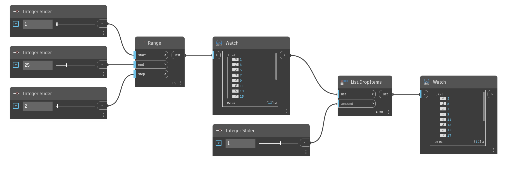

## Description approfondie
`List.DropItems` supprime le nombre d'éléments d'une liste spécifiée selon l'entrée `amount`. Si l'entrée `amount` est positive, les éléments sont supprimés à partir du début de la liste. Si l'entrée `amount` est négative, les éléments sont supprimés à partir de la fin de la liste.

Dans l'exemple ci-dessous, nous créons d'abord une liste à l'aide de l'entrée `Range`, puis nous supprimons le premier élément de la liste avec un noeud `List.DropItems` comportant une entrée `amount` de 1. Étant donné que l'entrée `amount` est positive, l'élément est supprimé à partir du début de la liste.
___
## Exemple de fichier

