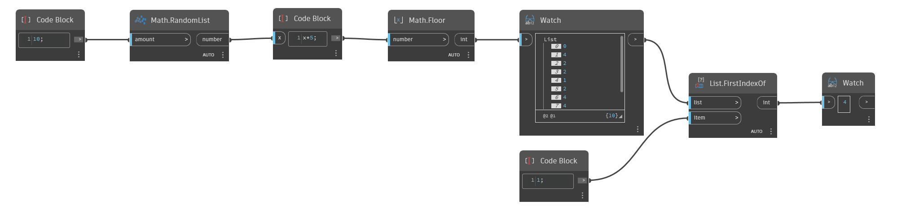

## Description approfondie
`List.FirstIndexOf` recherche dans une liste donnée un élément spécifié dans l'entrée `Item` et renvoie l'index de la première instance de cet élément dans la liste. Le noeud renvoie -1 si l'élément est introuvable dans la liste.

Dans l'exemple ci-dessous, nous générons d'abord une liste de 10 nombres aléatoires compris entre 0 et 4. En utilisant un noeud `List.FirstIndexOf`, nous recherchons un élément spécifique et récupérons l'index de la première instance de cet élément dans la liste.
___
## Exemple de fichier

