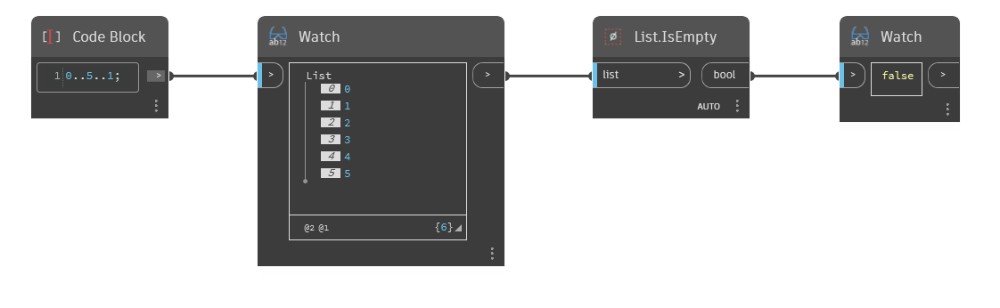

## Description approfondie
`List.IsEmpty` renvoie une valeur booléenne True si la liste d'entrée est vide et False si elle n'est pas vide.

Dans l'exemple ci-dessous, nous utilisons d'abord un Code Block pour générer une plage de nombres entre 0 et 5, avec un incrément de 1. Nous saisissons cette liste en entrée dans un noeud `List.IsEmpty`. Étant donné que la liste n'est pas vide, `List.IsEmpty` renvoie une valeur False.
___
## Exemple de fichier

