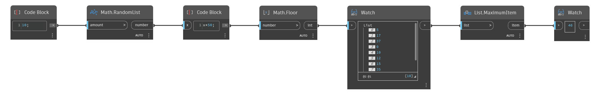

## Description approfondie
`List.MaximumItem` effectue une recherche dans une liste de valeurs et renvoie l'élément correspondant à la valeur la plus élevée.

Dans l'exemple ci-dessous, nous générons une liste de 10 nombres aléatoires compris entre 0 et 49. Nous utilisons ensuite un noeud `List.MaximumItem` pour trouver la valeur la plus élevée de la liste.
___
## Exemple de fichier

