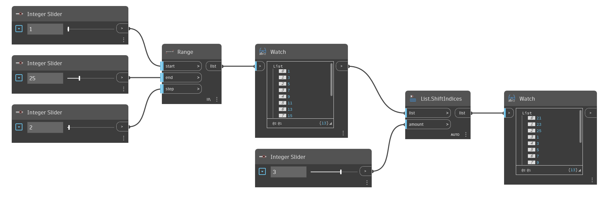

## Description approfondie
`List.ShiftIndices` décale la position des éléments d'une liste selon l'entrée `amount`. Un nombre positif dans l'entrée `amount` décale les index vers le haut, tandis qu'un nombre négatif décale les index vers le bas. Les éléments de la liste forment une boucle, entraînant le retour au début des éléments à la fin de la liste.

Dans l'exemple ci-dessous, nous générons d'abord une liste à l'aide de `Range`, puis nous déplaçons les index vers le haut de 3. Les 3 derniers nombres de la liste d'origine sont déplacés au début pour devenir les 3 premiers nombres de la nouvelle liste.
___
## Exemple de fichier

