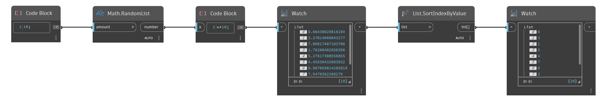

## Description approfondie
`List.SortIndexByValue` renvoie une liste d'index triés en fonction de leurs valeurs de membre dans l'ordre croissant.

Dans l'exemple ci-dessous, une liste de nombres aléatoires est triée et un nouvel ordre est renvoyé en tant que valeurs d'index.
___
## Exemple de fichier

