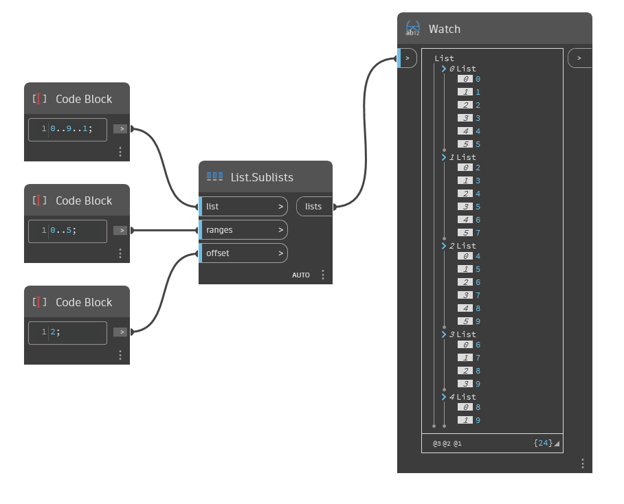

## Description approfondie
`List.Sublists` renvoie une série de sous-listes à partir d'une liste donnée en fonction de la plage d'entrée et du décalage. La plage détermine les éléments de la liste d'entrée placés dans la première sous-liste. Un décalage est appliqué à la plage et la nouvelle plage détermine la deuxième sous-liste. Ce processus se répète, augmentant l'index de début de la plage selon le décalage donné jusqu'à ce que la sous-liste résultante soit vide.

Dans l'exemple ci-dessous, nous commençons par une plage de nombres entre 0 et 9. La plage entre 0 et 5 est utilisée comme plage de sous-listes, avec un décalage de 2. Dans la sortie des sous-listes imbriquées, la première liste contient les éléments avec des index dans la plage entre 0 et 5 et la deuxième liste contient les éléments avec des index entre 2 et 7. Lorsque cela est répété, les sous-listes suivantes deviennent plus courtes à mesure que la fin de la plage dépasse la longueur de la liste initiale.
___
## Exemple de fichier

