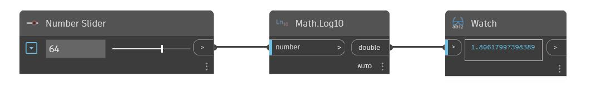

## Description approfondie
Log10 renvoie le logarithme en base 10 d'un numéro d'entrée. Dans l'exemple ci-dessous, nous utilisons un curseur numérique pour contrôler l'entrée d'un nœud Log10.
___
## Exemple de fichier

