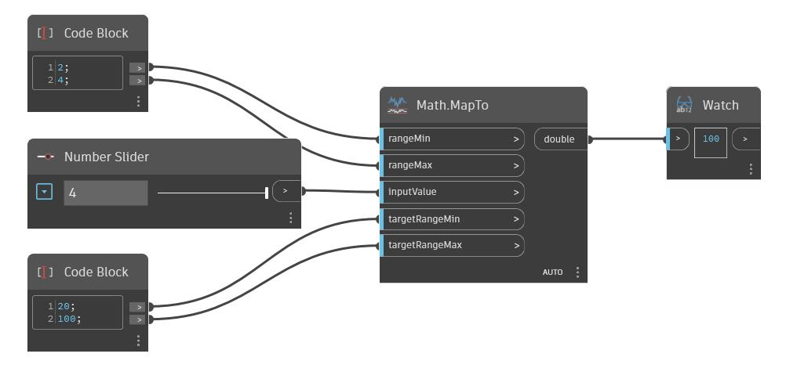

## Description approfondie
MapTo obtient la position d'un nombre dans un intervalle (similaire au nœud Map), puis mappe cette position vers un intervalle cible. Un nombre dans l'intervalle cible est renvoyé en fonction de la valeur de position. Dans l'exemple ci-dessous, le nombre 3 renvoie une position de 0.5 entre une plage de 2 et 4. Cette valeur de position de 0,5 dans un intervalle cible de 20 à 100 renvoie le nombre 60.
___
## Exemple de fichier

