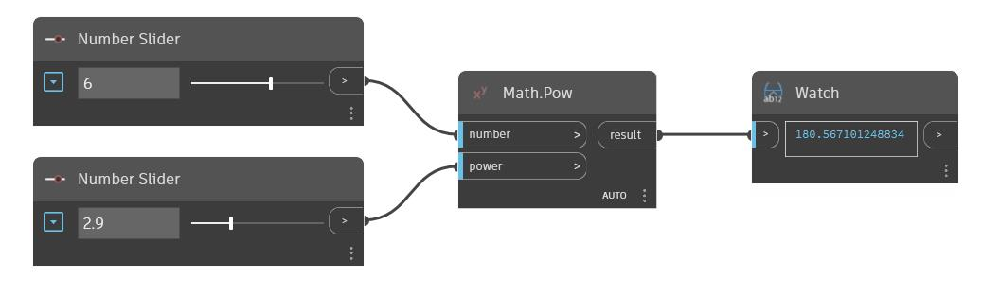

## Description approfondie
Pow renvoie le résultat d'un numéro d'entrée élevé à une puissance d'entrée. Dans l'exemple ci-dessous, nous utilisons deux curseurs numériques pour contrôler les deux entrées d'un nœud Pow.
___
## Exemple de fichier

