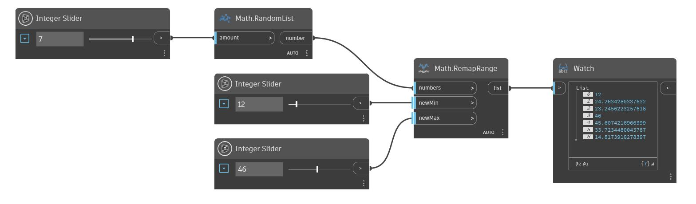

## Description approfondie
RemapRange utilise une liste de nombres et produit une mise à l'échelle linéaire de ces nombres dans un nouvel intervalle spécifié. La valeur minimale de la liste d'origine est mappée vers l'entrée newMin, tandis que la valeur maximale de la liste d'origine est mappée vers l'entrée newMax. Les nombres restants sont mis à l'échelle pour conserver le rapport de distribution. Dans l'exemple ci-dessous, nous utilisons un nœud RandomList pour générer une liste de nombres à remapper. Nous utilisons deux curseurs numériques pour contrôler les valeurs newMin et maxMin de la liste résultante.
___
## Exemple de fichier

