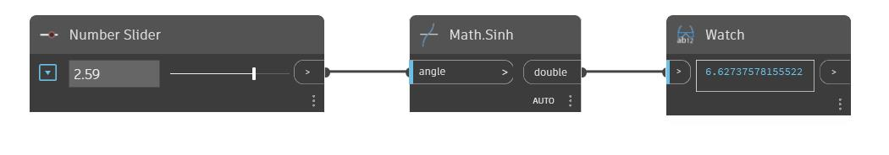

## Description approfondie
Sinh renvoie le sinus hyperbolique d'un angle d'entrée en radians. Dans l'exemple ci-dessous, nous utilisons un curseur numérique défini sur un intervalle compris entre -6,28 et 6,28 pour contrôler l'angle d'entrée d'un nœud Sinh.
___
## Exemple de fichier

