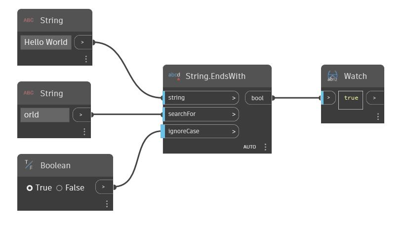

## In Depth
Ends With will return a boolean value based on whether a given string ends with a second input string. By default this node is case sensitive. A boolean value can be used in the 'ignoreCase' input to make the node ignore the case of the strings. In the example below, we use the string 'Hello World' as the original string, and use a second string 'orld' as the string to search for. Because 'Hello World' ends in the string 'orld', the EndsWith node returns true.
___
## Example File

