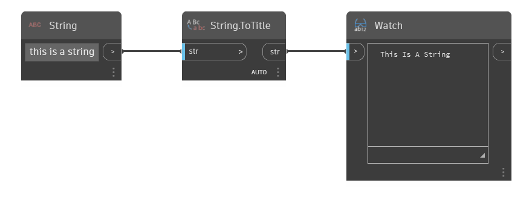

## Description approfondie
String.ToTitle applique la casse de titre à la chaîne d'entrée. La casse de titre est une variante de la chaîne où chaque première lettre est une majuscule.
___
## Exemple de fichier

