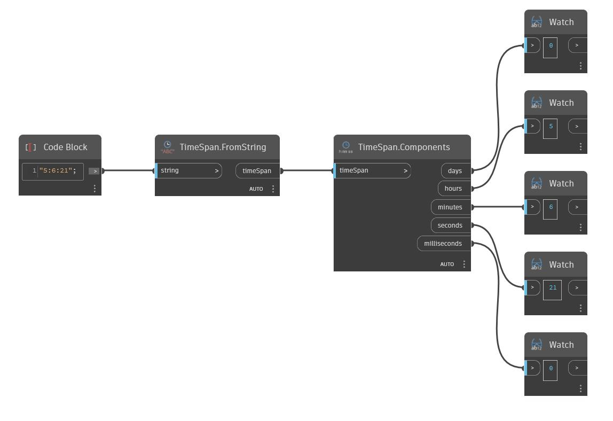

## Description approfondie
Components renvoie les jours, les heures, les minutes, etc. d'une TimeSpan. Dans l'exemple ci-dessous, une TimeSpan de 5:16:21 renvoie 0 jour, 5 heures, 6 minutes, 21 secondes et 0 milliseconde.
___
## Exemple de fichier

