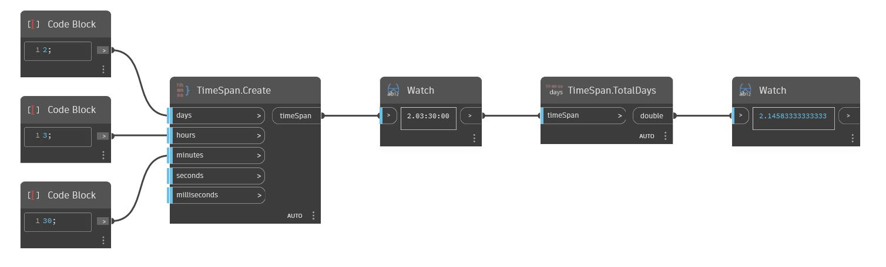

## Description approfondie
TotalDays renvoie le nombre de jours dans une TimeSpan sous forme de double. Dans l'exemple ci-dessous, le nombre total de jours retournés à partir de la TimeSpan 2.03:00:00 est ~2.1458333.
___
## Exemple de fichier

