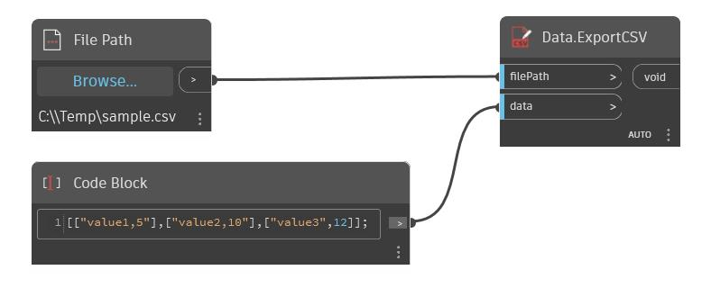

## Description approfondie
Écrit une liste de listes dans un fichier en séparant les valeurs par des virgules. La liste externe représente les lignes, les listes internes représentent les colonnes.
___
## Exemple de fichier

