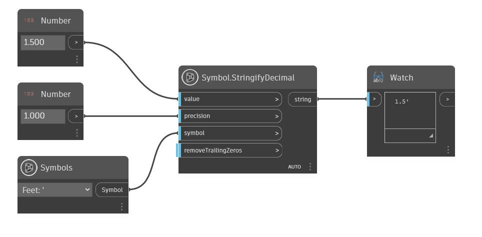

## Description approfondie
Symbol.StringifyFraction convertit la valeur d'entrée en une représentation de chaîne décimale avec le symbole d'unité donné. Inclut également une bascule pour supprimer ou non les zéros de fin.
___
## Exemple de fichier

