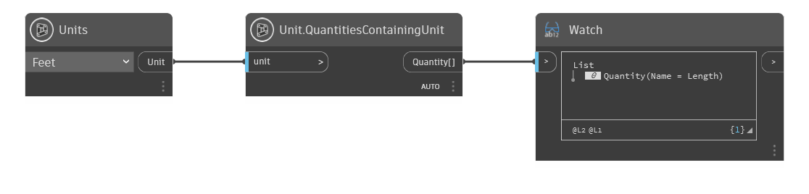

## Description approfondie
Unit.QuantitiesContainingUnit renvoie les quantités généralement utilisées pour un type d'unité sélectionné (par exemple, les pieds sont généralement utilisés dans une quantité de longueur)
___
## Exemple de fichier

