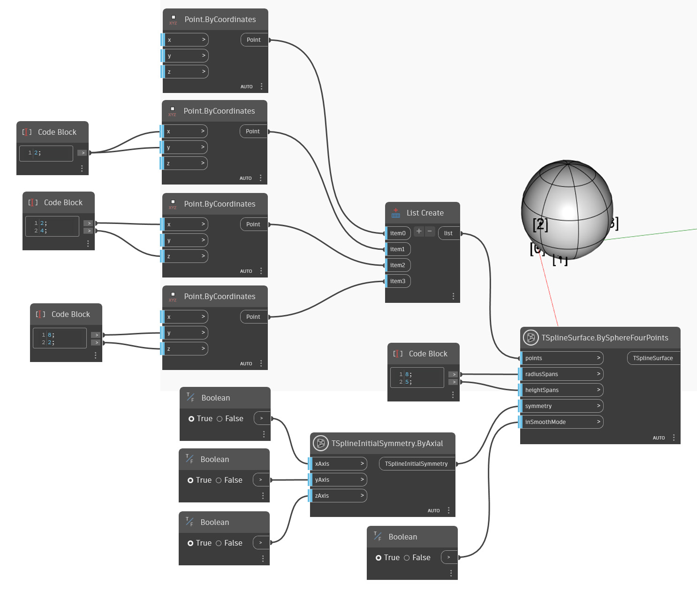

<!--- Autodesk.DesignScript.Geometry.TSpline.TSplineSurface.BySphereFourPoints --->
<!--- GLX34N2BPR4CQLUZBB4FTQ47NECC2T5CQ6KSRZQXSOY6HIHL5YGQ --->
## In-Depth
Dans l'exemple ci-dessous, une surface de primitive de sphère de T-Spline est créée à partir des quatre points fournis à l'aide du noeud `TSplineSurface.BySphereFourPoints`. Les entrées `radiusSpans` et `heightSpans` contrôlent le nombre de faces le long des segments de hauteur et de rayon (ou méridiens). La `symétrie` permet de contrôler si la forme a une symétrie initiale et, finalement, `inSmooth Mode` définit si l'aperçu est en mode lissage ou boîte.

## Exemple de fichier

