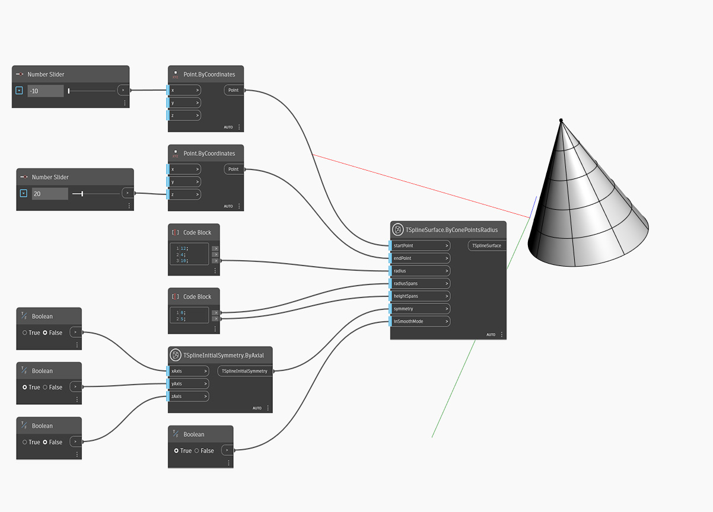

## In-Depth
Dans l'exemple ci-dessous, une primitive de cône de T-Spline est créée en utilisant le noeud `TSplineSurface.ByConePointsRadius`. La position et la hauteur du cône sont contrôlées par les deux entrées de `startPoint` et `endPoint`. Seul le rayon de base peut être ajusté avec l'entrée `radius` et le rayon supérieur est toujours égal à zéro. `radialSpans` et `heightSpans` permettent de déterminer les segments de rayon et de hauteur. La symétrie initiale de la forme est spécifiée par l'entrée `symmetry`. Si la symétrie X ou Y est définie sur True, la valeur des segments de rayons doit être un multiple de 4. Enfin, l'entrée `inSmoothMode` est utilisée pour passer du mode lisse au mode boîte pour afficher un aperçu de la surface de T-Spline.

## Exemple de fichier

