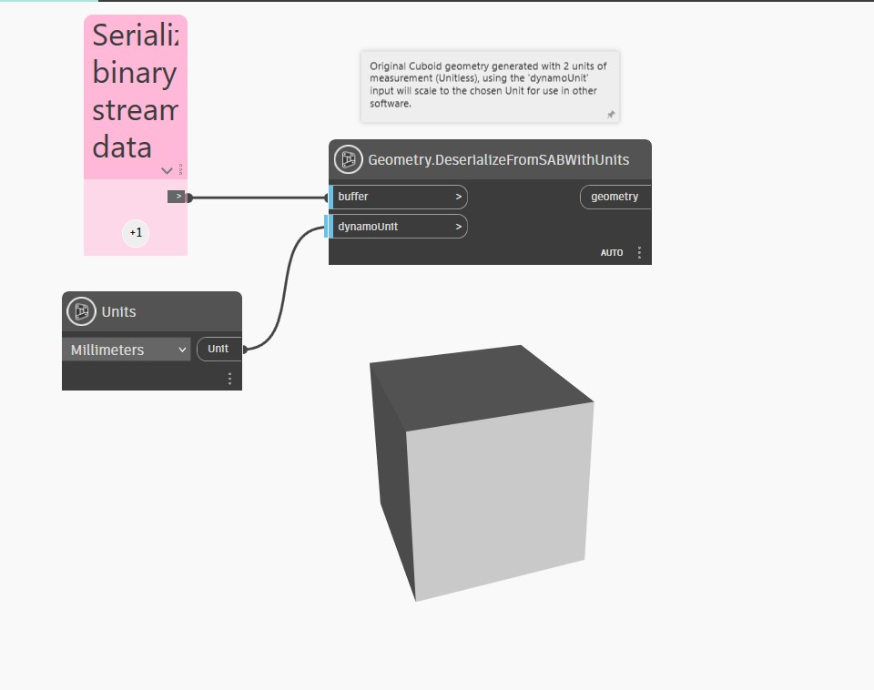

## Description approfondie
`Geometry.DeserializeFromSABWithUnits` importe une géométrie dans Dynamo à partir d'un tableau d'octets .SAB (Standard ACIS Binary) et d'un noeud `DynamoUnit.Unit` qui est convertible en millimètres. Ce noeud prend un octet[] comme première entrée et une valeur `dynamoUnit` comme deuxième entrée. Si l'entrée `dynamoUnit` est une valeur nulle, le noeud importe la géométrie du fichier .SAB sans unité, en important des données géométriques dans le tableau sans conversion d'unité. Si une unité est indiquée, les unités internes du tableau .SAB sont converties dans les unités spécifiées.

Dynamo est sans unité, mais les valeurs numériques de votre graphique Dynamo ont probablement toujours une unité implicite. Vous pouvez utiliser l'entrée `dynamoUnit` pour mettre à l'échelle la géométrie interne du fichier .SAB vers ce système d'unités.

Dans l'exemple ci-dessous, un cuboïde est généré à partir d'un fichier SAB avec 2 unités de mesure (sans unité). L'entrée `dynamoUnit` met à l'échelle l'unité choisie pour une utilisation dans d'autres logiciels.

___
## Exemple de fichier

