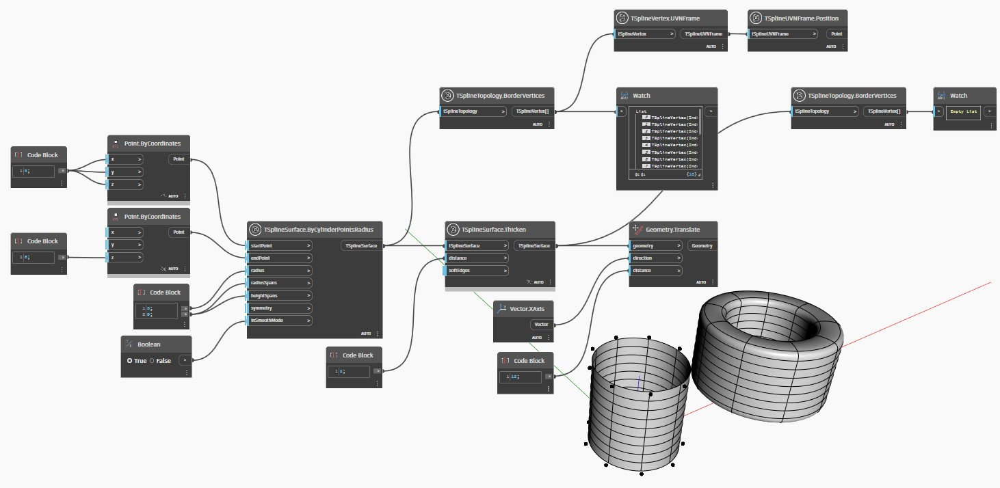

<!--- Autodesk.DesignScript.Geometry.TSpline.TSplineTopology.BorderVertices --->
<!--- HQ6POKIVNCM33NLZR7L63JAH22EKXEGGTWB4ZJMFEMLFXZYJDPHQ --->
## Description approfondie
`TSplineTopology.BorderVertices` renvoie une liste de sommets de bordures contenus dans une surface de T-Spline.

Dans l'exemple ci-dessous, deux surfaces de T-Spline sont créées par l'intermédiaire de `TSplineSurface.ByCylinderPointsRadius`. L'une est une surface ouverte et l'autre est épaissie à l'aide de `TSplineSurface.Thicken`, ce qui la transforme en surface fermée. Lorsque les deux sont examinées à l'aide du noeud `TSplineTopology.BorderVertices`, la première renvoie une liste de les sommets de bordure, tandis que le second renvoie une liste vide. En effet, étant donné que la surface est fermée, elle ne contient aucun sommet de bordure.
___
## Exemple de fichier

