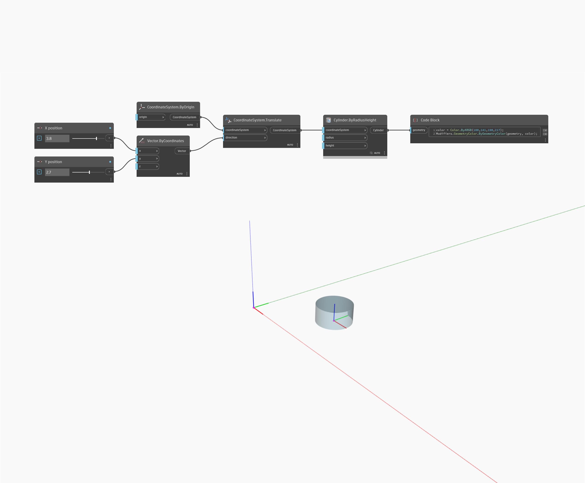

<!--- Autodesk.DesignScript.Geometry.CoordinateSystem.Translate(direction) --->
<!--- J6B66BZEMF27NPFMYVT6JCYWPDCWFILNXLELR2HGZK3CRUODWPUA --->
## Description approfondie
Convertit l'objet dans la direction et la magnitude du vecteur d'entrée.
___
## Exemple de fichier

