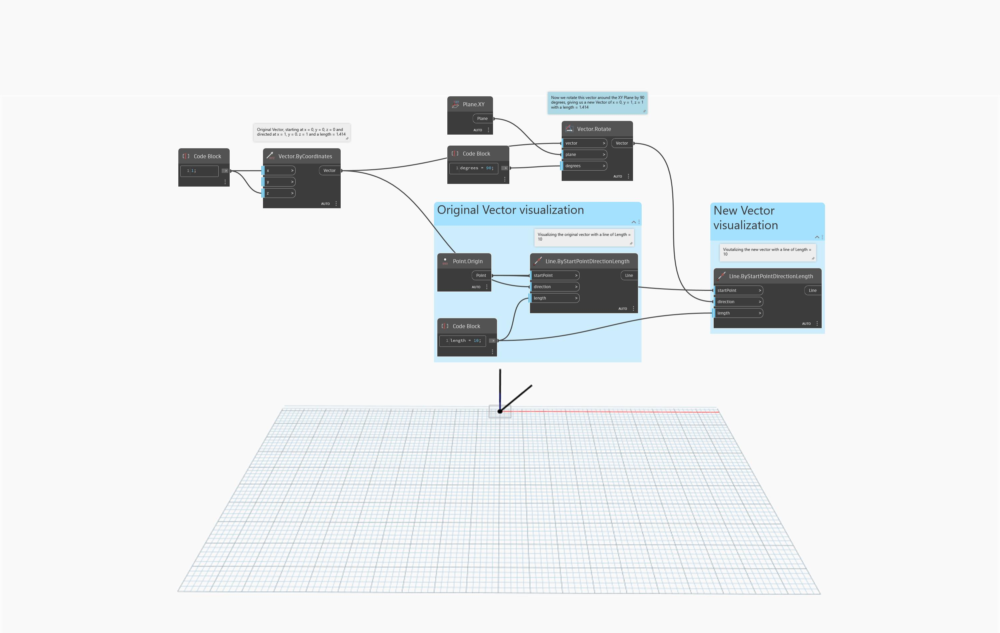

<!--- Autodesk.DesignScript.Geometry.Vector.Rotate(vector, plane, degrees) --->
<!--- KIWQMTKYTV555M5VBMXQPP5T2SOWPLBC5NHE2QXRVMJY5EJJY7BA --->
## Description approfondie
`Vector.Rotate (vector, plane, degrees)` fait pivoter un vecteur autour de l'origine et de la normale du plan d'un degré spécifié.

Dans l'exemple ci-dessous, un vecteur est pivoté autour du plan XY de 90 degrés et visualisé avec une ligne.
___
## Exemple de fichier

