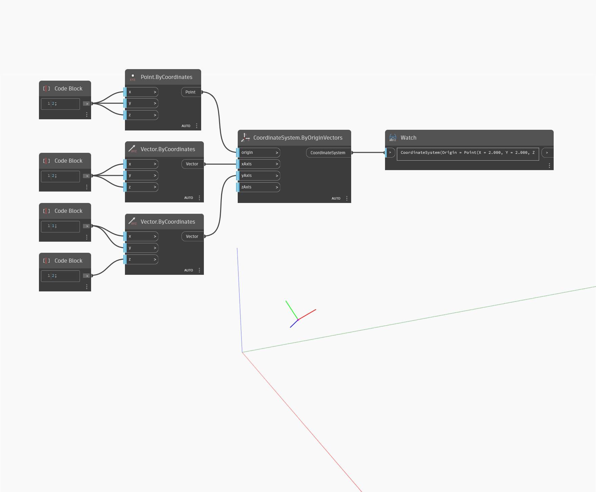

<!--- Autodesk.DesignScript.Geometry.CoordinateSystem.ByOriginVectors(origin, xAxis, yAxis, zAxis) --->
<!--- KLFVJ5DI7APVNODARMSE3JM5C27DG62OXUUQRS3HCDTZYO6IBOZA --->
## Description approfondie
`CoordinateSystem.ByOriginVectors (origin, xAxis, yAxis, zAxis)` renvoie un nouveau CoordinateSystem à un point d'origine d'entrée avec les axes d'entrée X, Y et Z.

Dans l'exemple ci-dessous, le CoordinateSystem est placé à une origine avec de nouveaux vecteurs pour les axes X, Y et Z. Cela donne un CoordinateSystem pivoté par rapport au CoordinateSystem d'origine.

___
## Exemple de fichier

