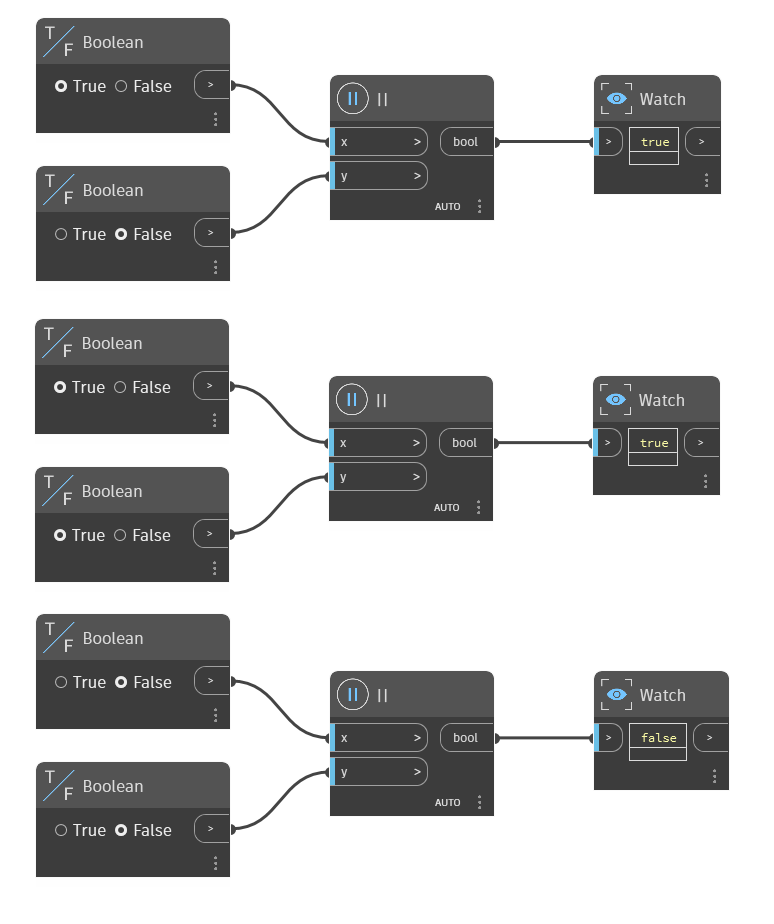

## Description approfondie
Le noeud "||" est l'opérateur Ou. Il prend deux valeurs booléennes comme entrées et renvoie True si une ou les deux valeurs sont True. Si les deux valeurs sont False, il renvoie False. Dans l'exemple ci-dessous, trois noeuds "||" sont utilisés pour déterminer si au moins l'un des booléens d'entrée est True. Le premier noeud a une entrée True et False, donc il renvoie True. Le deuxième noeud a deux entrées True, donc il renvoie True. Le troisième noeud a deux entrées False, donc il renvoie False.
___
## Exemple de fichier

