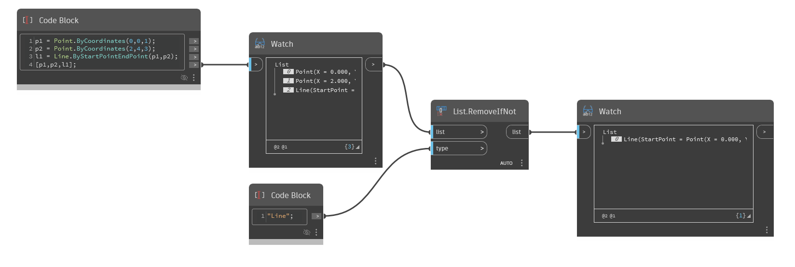

## Description approfondie
`List.RemoveIfNot` renvoie une liste qui conserve les éléments correspondant au type d'élément spécifié et supprime tous les autres éléments de la liste d'origine.

Vous devrez peut-être utiliser le chemin d'accès complet au noeud, par exemple `Autodesk.DesignScript.Geometry.Surface`, dans l'entrée `type` pour supprimer des éléments. Pour récupérer les chemins d'accès des éléments de la liste, vous pouvez saisir votre liste dans un noeud `Object.Type`.

Dans l'exemple ci-dessous, `List.RemoveIfNot` renvoie une liste avec une ligne, en supprimant les éléments de point de la liste d'origine, car ils ne correspondent pas au type spécifié.
___
## Exemple de fichier

