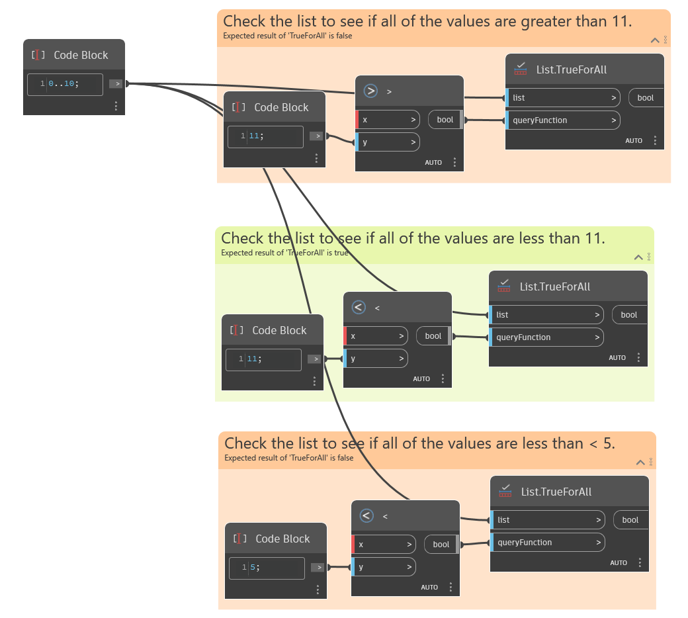

## Description approfondie
`List.TrueForAll` renvoie une valeur booléenne indiquant si la condition de l'entrée `queryFunction` est True pour tous les éléments de la liste. L'entrée `queryFunction` doit être une valeur booléenne.

L'exemple ci-dessous montre trois fonctions utilisées pour évaluer une liste d'entrée. La première utilise un noeud supérieur à (>) pour évaluer si toutes les valeurs de la liste sont supérieures à 11, ce qui renvoie False. La deuxième utilise un noeud inférieur à (<) pour évaluer si toutes les valeurs de la liste sont inférieures à 11, ce qui renvoie True. La troisième utilise un noeud inférieur à (<) pour évaluer si toutes les valeurs de la liste sont inférieures à 5, ce qui renvoie False.
___
## Exemple de fichier

