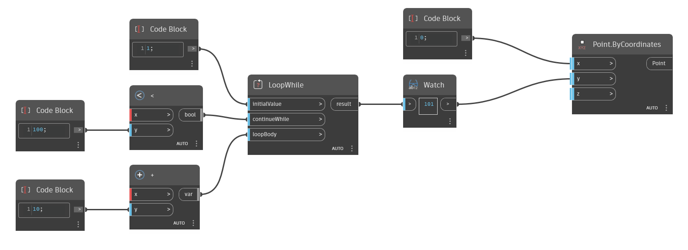

## Description approfondie
`LoopWhile` renvoie le résultat d'une fonction en boucle jusqu'à ce que les contraintes soient respectées.

Dans l'exemple ci-dessous, une boucle simple est créée pour ajouter 10, en commençant par 1, jusqu'à ce que le résultat soit supérieur à 100. `LoopWhile` accepte les variables pour son entrée `initialValue` et les fonctions pour les entrées `continueWhile` et `loopBody`. `continueWhile` définit les contraintes de la boucle qui, dans cet exemple, est une fonction Less Than et un argument de 1000.`loopBody` définit la fonction de la boucle qui, dans cet exemple, est une fonction Add avec un argument de 10.
___
## Exemple de fichier

