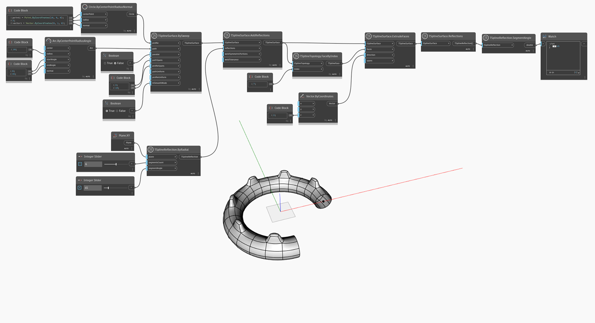

<!--- Autodesk.DesignScript.Geometry.TSpline.TSplineReflection.SegmentAngle --->
<!--- M2WJT5G52MFWUUNWUZWTY2TSRSRY6GVVIAT4LLVJUC2VVLHVGW7A --->
## In-Depth
`TSplineReflection.SegmentAngle` renvoie l'angle entre chaque paire de segments de réflexion radiale. Si le type de TSplineReflection est Axial, le noeud renvoie 0.

Dans l'exemple ci-dessous, une surface de T-Spline est créée avec des réflexions ajoutées. Plus loin dans le graphique, la surface est interrogée avec le noeud `TSplineSurface.Reflections`. Le résultat (une réflexion) est ensuite utilisé comme entrée pour `TSplineReflection.SegmentAngle` afin de renvoyer l'angle entre les segments d'une réflexion radiale.

## Exemple de fichier

