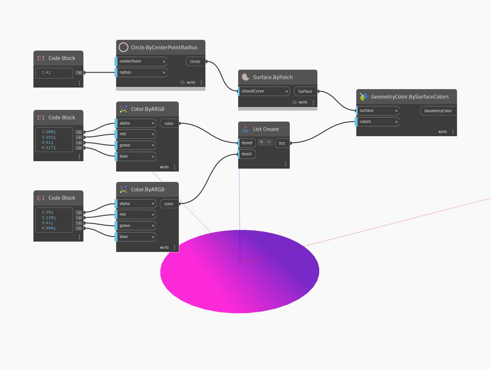

## Description approfondie
BySurfaceColors affiche la géométrie d'entrée avec un dégradé de couleurs. Dans l'exemple ci-dessous, un cercle s'affiche avec un dégradé de deux couleurs RVB. Sauf si cela est désactivé, l'aperçu de la géométrie d'origine recouvre la nouvelle géométrie colorée.
___
## Exemple de fichier

