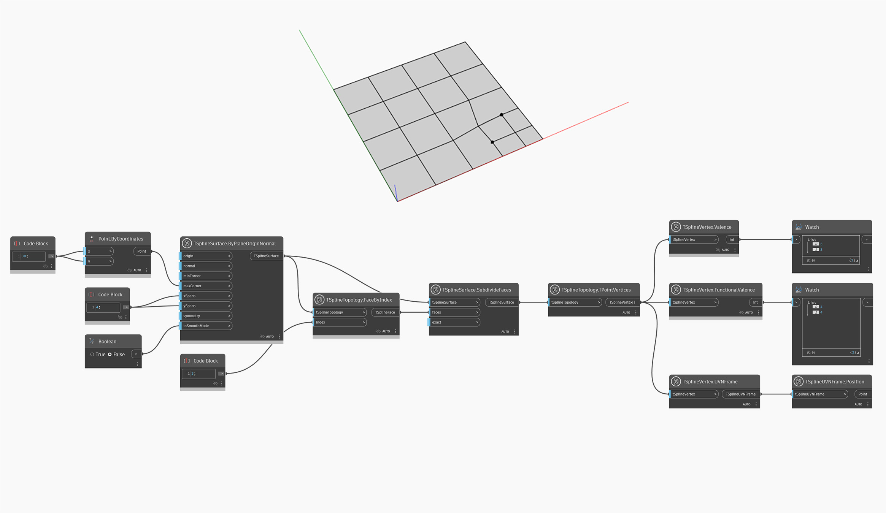

<!--- Autodesk.DesignScript.Geometry.TSpline.TSplineVertex.FunctionalValence --->
<!--- N44VZ3AJYWSL6V3DZOJYGO3ER47KV2Q6UNXWX7N6U47NDLFO3TBQ --->
## In-Depth
La valence fonctionnelle d'un sommet va au-delà du simple décompte des arêtes adjacentes et prend en compte les lignes de grille virtuelles qui ont un impact sur la fusion du sommet dans la zone qui l'entoure. Elle fournit une compréhension plus nuancée de la façon dont les sommets et leurs arêtes influencent la surface lors des opérations de déformation et d'affinement.
Utilisé sur des sommets et des points T réguliers, le noeud `TSplineVertex.FunctionalValence` renvoie la valeur "4", ce qui signifie que la surface est guidée par des splines formant une grille. Une valence fonctionnelle autre que "4" signifie que le sommet est un point d'étoile et que le mélange autour du sommet sera moins lisse.

Dans l'exemple ci-dessous, le noeud `TSplineVertex.FunctionalValence` est utilisé sur deux sommets de Point T d'une surface de plan de T-Spline. Le noeud `TSplineVertex.Valence` renvoie la valeur 3, tandis que la valence fonctionnelle des sommets sélectionnés est de 4, ce qui est spécifique aux points T. Les noeuds `TSplineVertex.UVNFrame` et `TSplineUVNFrame.Position` sont utilisés pour visualiser la position des sommets en cours d'analyse.

## Exemple de fichier

