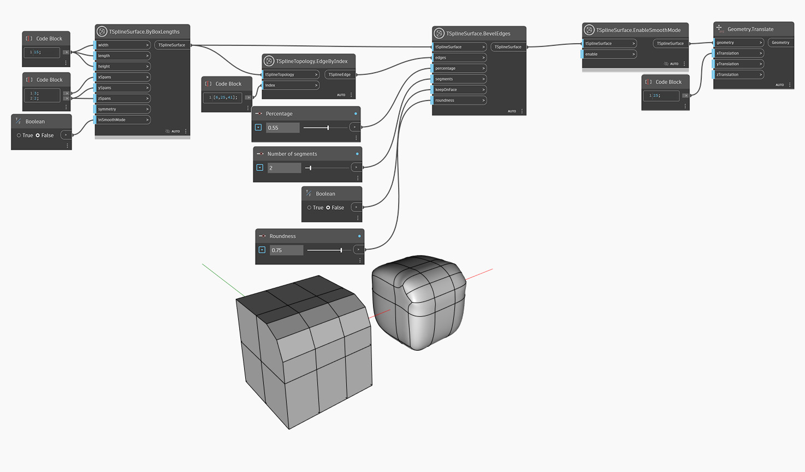

<!--- Autodesk.DesignScript.Geometry.TSpline.TSplineSurface.EnableSmoothMode --->
<!--- NN2ZH7ONXE6AF3LL2XG7BSXNABGZRF4KYTGXDYF24O5PLZ2GWW4Q --->
## Description approfondie
Le mode Boîte et le mode Lissage sont deux façons de visualiser une surface de T-Spline. Le mode Lissage est la forme réelle d'une surface de T-Spline et est utile pour prévisualiser l'esthétique et les dimensions du modèle. Le mode Boîte, en revanche, peut fournir un aperçu de la structure de la surface et permettre de mieux la comprendre. Il s'agit aussi d'une option plus rapide pour prévisualiser une géométrie volumineuse ou complexe. Le noeud `TSplineSurface .EnableSmoothMode` permet de basculer entre ces deux états d'aperçu à différents stades du développement de la géométrie.

Dans l'exemple ci-dessous, l'opération Biseau est effectuée sur une surface de boîte de T-Spline. Le résultat est d'abord visualisé en mode boîte (l'entrée `inSmoothMode` de la surface de boîte définie sur False) pour une meilleure compréhension de la structure de la forme. Le mode lisse est ensuite activé via le noeud `TSplineSurface.EnableSmoothMode` et le résultat est traduit vers la droite pour afficher un aperçu des deux modes en même temps.
___
## Exemple de fichier

