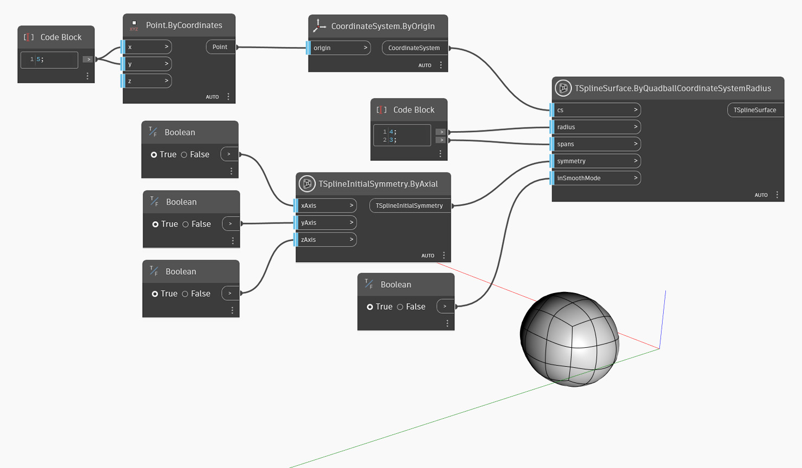

## In-Depth
Dans l'exemple ci-dessous, un quadball de primitive de T-Spline est créé, positionné sur un système de coordonnées local `cs`, avec un `rayon` donné et divisé par le nombre donné de `segments`. La symétrie initiale de la forme est spécifiée par l'entrée `symétrie`. Enfin, l'entrée `inSmoothMode` est utilisée pour passer du mode lissage au mode boîte pour afficher un aperçu de la surface de T-Spline.

## Exemple de fichier

