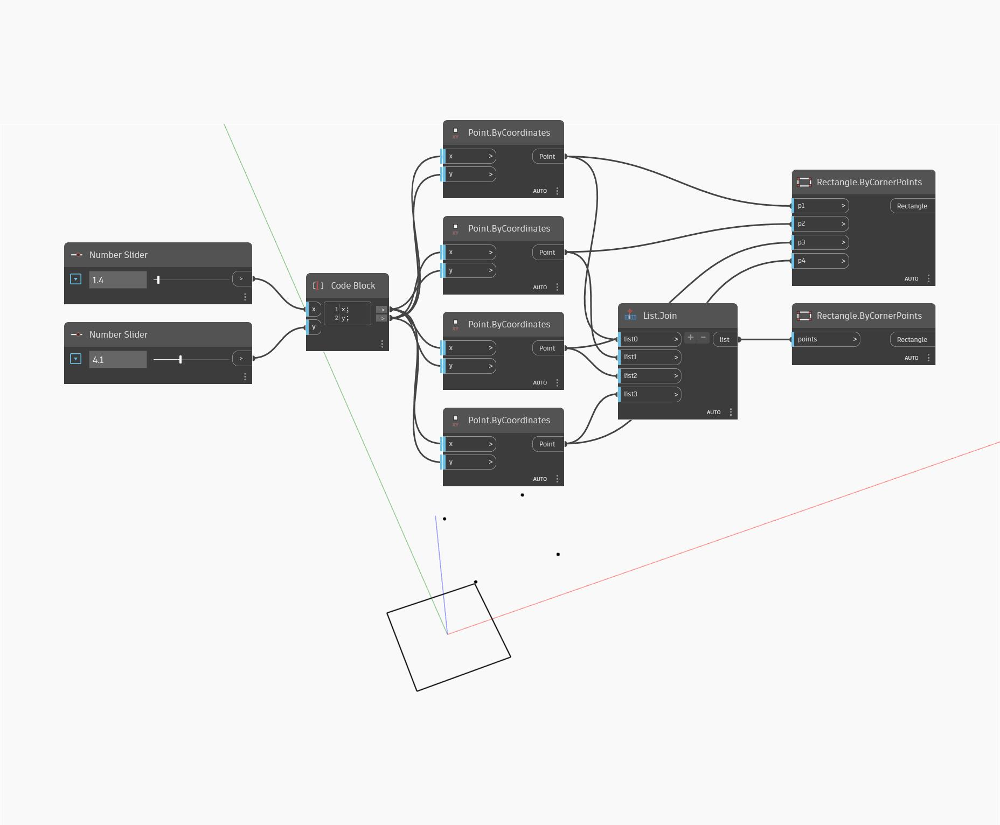

<!--- Autodesk.DesignScript.Geometry.Rectangle.ByCornerPoints(p1, p2, p3, p4) --->
<!--- OPQ3MDKAFIBB5WD3XJ65RI5GHYZKCQG4WU3XBCFBOP526FMMNPZQ --->
## Description approfondie
Le nœud Rectangle ByCornerPoints prend quatre points d'entrée et crée un rectangle à partir de ces points. Les points d'entrée doivent refléter une forme rectangulaire. Dans cet exemple, deux curseurs numériques sont utilisés pour créer les Points ByCoordinates aux sommets du rectangle. Un nœud Rectangle ByCornerPoints similaire mais distinct utilise une liste de points comme entrée plutôt que chaque entrée séparément. Les deux nœuds sont illustrés dans cet exemple.
___
## Exemple de fichier

